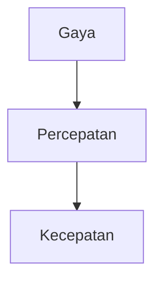

# 🤝 Panduan Berkontribusi — KF13

Terima kasih atas minat Anda untuk berkontribusi pada **Klub Fisika Indonesia (KF13)**! 🎉

Proyek ini terbuka untuk semua orang — Anda tidak harus seorang developer untuk berkontribusi. Setiap kontribusi, sekecil apa pun, sangat berarti bagi perkembangan literasi sains di Indonesia.

---

## 📋 Daftar Isi

- [Kode Etik](#-kode-etik)
- [Area Kontribusi](#-area-kontribusi)
- [Cara Berkontribusi](#-cara-berkontribusi)
- [Development Setup](#-development-setup)
- [Menulis Artikel Blog](#-menulis-artikel-blog)
- [Development Workflow](#-development-workflow)
- [Style Guide](#-style-guide)
- [Testing](#-testing)
- [Pull Request Process](#-pull-request-process)
- [Komunikasi](#-komunikasi)

---

## 📜 Kode Etik

Proyek ini mengadopsi [Contributor Covenant Code of Conduct](CODE_OF_CONDUCT.md). Dengan berpartisipasi, Anda setuju untuk mematuhi ketentuannya. **Singkatnya: hormati sesama, bangun bersama.**

---

## 🎯 Area Kontribusi

### ✍️ **Konten & Penulisan** (Cocok untuk: SEMUA ORANG)

- Menulis artikel baru tentang topik fisika (mekanika, termodinamika, elektromagnetisme, fisika modern, dll.)
- Menerjemahkan artikel existing ke Bahasa Inggris (atau sebaliknya)
- Memperbaiki typo, tata bahasa, atau kesalahan faktual
- Menambah ilustrasi, diagram, atau foto eksperimen
- Membuat tutorial eksperimen fisika sederhana

### 💻 **Development** (Cocok untuk: DEVELOPER)

- Fix bug atau isu yang dilaporkan
- Menambah fitur baru (lihat label `enhancement`)
- Optimasi performa (Lighthouse score, bundle size)
- Aksesibilitas (WCAG compliance)
- Dark mode improvements
- Responsive design untuk berbagai device

### 🎨 **Desain** (Cocok untuk: DESAINER)

- UI/UX improvement
- Ilustrasi dan infografis
- Komponen visual baru
- Brand identity & konsistensi

### 📖 **Dokumentasi**

- Tutorial setup untuk pemula
- Terjemahan dokumentasi
- FAQ dan troubleshooting guide

### 🧪 **Testing & QA**

- Report bug di GitHub Issues
- Menambah test coverage (Playwright)
- Manual testing di berbagai device/browser

---

## 🏁 Cara Berkontribusi

### Untuk Kontributor Baru

1. **Cari issue** dengan label [`good first issue`](https://github.com/klubfisika/klubfisika.github.io/labels/good%20first%20issue)
2. **Komentari issue** tersebut: "Saya ingin mengerjakan ini"
3. **Fork repo** dan clone ke lokal
4. **Buat branch** dari `main`
5. **Commit** perubahan Anda
6. **Push** ke fork Anda
7. **Buat Pull Request** ke `main`

### Untuk Kontributor Non-Code

Anda bisa berkontribusi tanpa menulis kode sama sekali:
- **Buka Issue** baru untuk melaporkan bug atau memberi saran
- **Kirim artikel** melalui Pull Request (cukup file `.mdx` baru di `src/content/blog/`)
- **Review** Pull Request orang lain
- **Diskusikan** di GitHub Discussions

---

## 🛠️ Development Setup

### Prasyarat

- [Node.js](https://nodejs.org) v18+
- [pnpm](https://pnpm.io) v10+
- Git

### Setup Lokal

```bash
# 1. Fork & clone
git clone https://github.com/YOUR_USERNAME/klubfisika.github.io.git
cd klubfisika.github.io

# 2. Tambahkan upstream remote
git remote add upstream https://github.com/klubfisika/klubfisika.github.io.git

# 3. Install dependencies
pnpm install

# 4. Jalankan dev server
pnpm dev
# Buka http://localhost:4321

# 5. Jalankan test
pnpm test
```

### Scripts

| Command | Deskripsi |
|---------|-----------|
| `pnpm dev` | Development server (hot reload) |
| `pnpm build` | Production build |
| `pnpm preview` | Preview hasil build |
| `pnpm test` | Jalankan Playwright test suite |
| `pnpm test:ui` | Playwright UI mode |
| `pnpm lint` | ESLint check |
| `pnpm lint:fix` | ESLint auto-fix |

---

## ✍️ Menulis Artikel Blog

Artikel disimpan di `src/content/blog/` dalam format **MDX** (Markdown + JSX components).

### Struktur Frontmatter

```yaml
---
title: "Judul Artikel"
excerpt: "Deskripsi singkat (1-2 kalimat)"
category: "Mekanika"  # Kategori fisika
tags: ["newton", "eksperimen"]
author: "Nama Penulis"
date: "2024-12-26"
readTime: "5 menit"
image: "@assets/images/physics-general.webp"
---
```

### Fitur MDX

**Rumus Matematika (KaTeX):**
```mdx
Energi kinetik: $$E_k = \frac{1}{2}mv^2$$
Inline: $F = ma$
```

**Diagram (Mermaid):**
````mdx

````

**Callout/Tips:**
```mdx
:::tip[Tips Eksperimen]
Gunakan bahan yang mudah ditemukan di rumah!
:::
```

**Gambar:**
```mdx

```

> Untuk contoh lengkap, lihat artikel existing di `src/content/blog/`.

---

## 💻 Development Workflow

### Alias Path

| Alias | Path |
|-------|------|
| `@components/*` | `src/components/*` |
| `@layouts/*` | `src/layouts/*` |
| `@assets/*` | `src/assets/*` |
| `@styles/*` | `src/styles/*` |
| `@data/*` | `src/data/*` |
| `@types/*` | `src/types/*` |

### Komponen Astro

```astro
---
import Layout from '@layouts/Layout.astro';
import Heading from '@ui/Heading.astro';
---

<Layout title="Halaman Baru">
  <Heading level={1}>Judul Halaman</Heading>
  <!-- konten -->
</Layout>
```

---

## 🎨 Style Guide

### Kode

- **TypeScript** untuk file `.ts`
- **Astro** untuk komponen halaman
- **Tailwind CSS v4** untuk styling (CSS-first config)
- Format otomatis dengan Prettier (via ESLint)
- Commit message dalam **Bahasa Indonesia** atau **English**

### Commit Convention

```
feat: tambah halaman eksperimen interaktif
fix: perbaiki null safety di FeaturedArticle
docs: tambah panduan kontribusi konten
style: rapikan spacing di komponen Card
refactor: pisahkan logika dark mode toggle
test: tambah test untuk halaman blog
```

### Design Tokens

Semua warna didefinisikan di `src/styles/brutalist.css` — jangan hardcode warna di komponen:

```css
/* ✅ Benar */
<button class="bg-primary text-on-primary">...</button>

/* ❌ Salah */
<button style="background: #1e40af; color: white">...</button>
```

---

## 🧪 Testing

Proyek ini menggunakan **Playwright** untuk end-to-end testing dan aksesibilitas.

```bash
# Semua test
pnpm test

# Satu file test
pnpm exec playwright test tests/landing.spec.ts

# Debug mode
pnpm test:ui
```

### Menambah Test Baru

```typescript
import { test, expect } from '@playwright/test';

test.describe('Halaman Baru', () => {
  test('judul halaman sesuai', async ({ page }) => {
    await page.goto('/halaman-baru');
    await expect(page).toHaveTitle(/Judul/);
  });
});
```

---

## 📬 Pull Request Process

### Sebelum Membuat PR

1. ✅ Test lulus: `pnpm test`
2. ✅ Lint bersih: `pnpm lint`
3. ✅ Rebase ke `main` terbaru
4. ✅ Commit message jelas dan deskriptif

### Template PR

```markdown
## Deskripsi
[Jelaskan perubahan yang Anda buat]

## Tipe Perubahan
- [ ] Bug fix
- [ ] Fitur baru
- [ ] Artikel/konten baru
- [ ] Dokumentasi
- [ ] Improvement

## Testing
- [ ] `pnpm test` lulus
- [ ] `pnpm lint` lulus
- [ ] Manual testing di browser

## Screenshot (jika ada UI change)
[Lampirkan screenshot]
```

### Review Process

1. Maintainer akan review PR Anda dalam 2-3 hari
2. Bisa jadi ada permintaan perubahan — itu normal!
3. Setelah approved, PR akan di-merge oleh maintainer

---

## 💬 Komunikasi

- **GitHub Issues**: Untuk bug, feature request, diskusi teknis
- **GitHub Discussions**: Untuk pertanyaan umum dan ide
- **WhatsApp**: Hubungi admin di nomor yang tertera di website

---

## 🏆 Contributor Recognition

Setiap kontributor akan dicantumkan di halaman [Tim Kami](https://klubfisika.github.io/about). Kontribusi Anda sangat berarti bagi perkembangan literasi sains di Indonesia!

---

<p align="center">
  <strong>Mari bangun literasi sains Indonesia bersama-sama! 🇮🇩🚀</strong>
</p>
