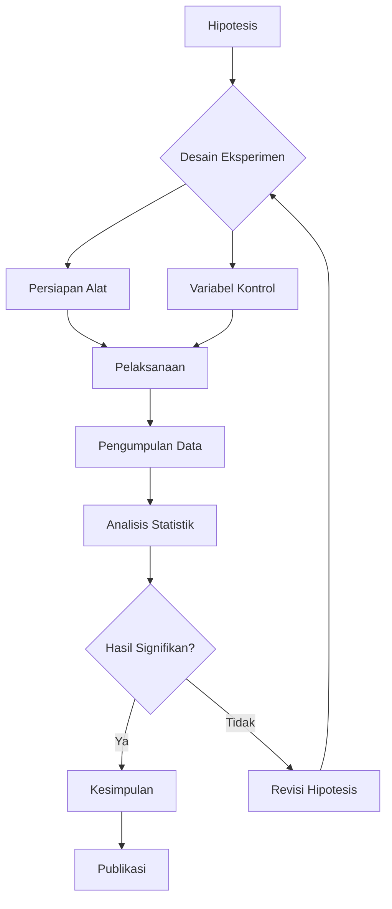
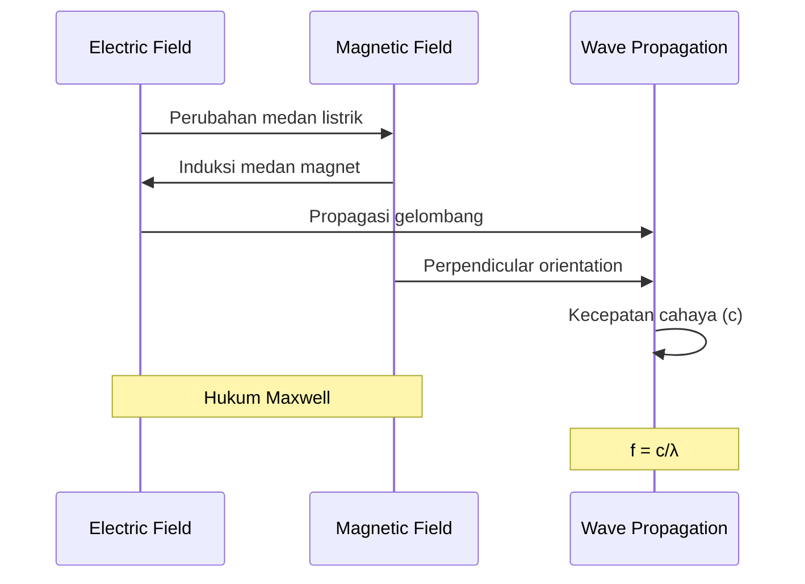
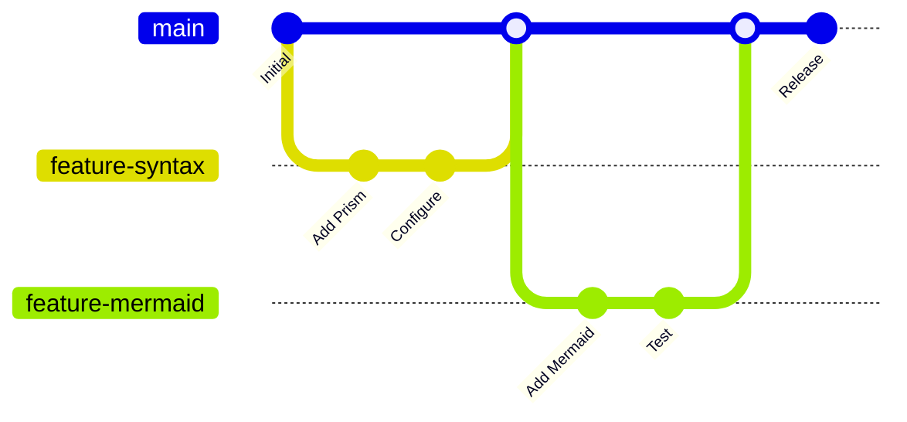
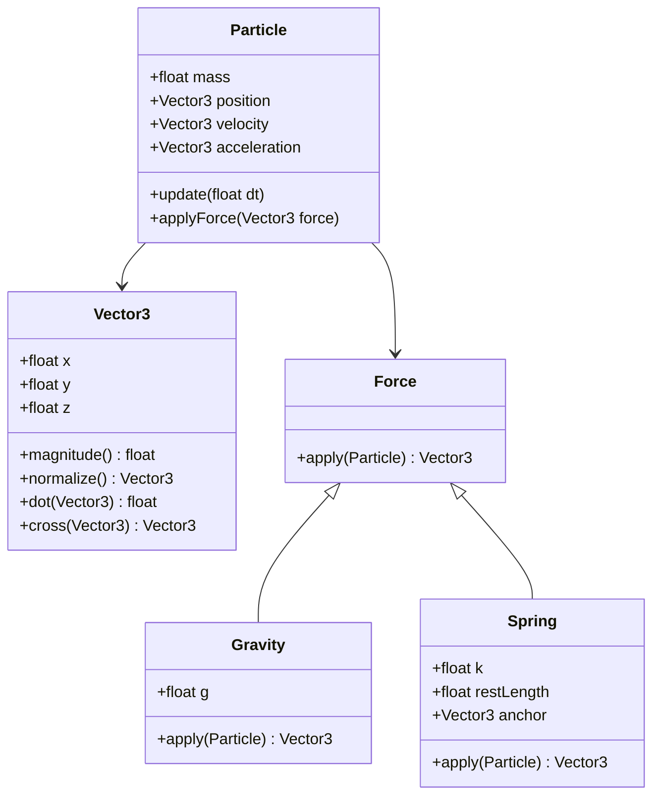

# Test Artikel: Syntax Highlighting & Typography

Artikel ini untuk testing berbagai fitur typography dan rendering di blog KF13.

## 1. Code Syntax Highlighting

### JavaScript/TypeScript
```javascript
// Fira Code ligatures test: != >= <= => === !== && ||
const calculateVelocity = (distance, time) => {
  if (time !== 0 && distance >= 0) {
    return distance / time;
  }
  return null;
};

// Arrow functions and destructuring
const physics = {
  constants: {
    c: 299792458, // m/s
    g: 9.81,      // m/s²
    h: 6.626e-34  // J⋅s
  }
};

const { c, g, h } = physics.constants;
console.log(`Speed of light: ${c} m/s`);
```

### Python
```python
import numpy as np
import matplotlib.pyplot as plt

# Fira Code ligatures: != >= <= => === !== && ||
def wave_function(x, t, amplitude=1, frequency=1, phase=0):
    """
    Calculate wave displacement at position x and time t
    """
    omega = 2 * np.pi * frequency
    return amplitude * np.sin(omega * t - x + phase)

# List comprehension and f-strings
positions = [i * 0.1 for i in range(100)]
displacements = [wave_function(x, 0) for x in positions]

# Plotting
plt.plot(positions, displacements)
plt.title(f"Wave Function: A={amplitude}, f={frequency}")
```

### Rust
```rust
// Fira Code ligatures test
use std::collections::HashMap;

#[derive(Debug, Clone)]
struct Particle {
    mass: f64,
    velocity: Vec3,
    position: Vec3,
}

impl Particle {
    fn kinetic_energy(&self) -> f64 {
        0.5 * self.mass * self.velocity.magnitude_squared()
    }
    
    // Pattern matching and Option types
    fn collision_time(&self, other: &Particle) -> Option<f64> {
        let relative_velocity = &self.velocity - &other.velocity;
        
        match relative_velocity.magnitude() {
            v if v > 0.0 => Some(self.distance_to(other) / v),
            _ => None,
        }
    }
}

// Closure with move semantics
let particles: Vec<Particle> = vec![];
let total_energy = particles.iter()
    .map(|p| p.kinetic_energy())
    .fold(0.0, |acc, e| acc + e);
```

### CSS
```css
/* Fira Code ligatures in CSS comments: != >= <= => */
.physics-formula {
  font-family: 'Fira Code', 'JetBrains Mono', monospace;
  font-variant-ligatures: common-ligatures;
  font-feature-settings: "liga" 1, "calt" 1;
}

/* CSS Grid and Flexbox */
.experiment-grid {
  display: grid;
  grid-template-columns: repeat(auto-fit, minmax(300px, 1fr));
  gap: 2rem;
  
  /* Logical properties */
  padding-inline: 1rem;
  margin-block: 2rem;
}

/* CSS Custom Properties */
:root {
  --primary-hue: 240;
  --primary-saturation: 100%;
  --primary-lightness: 50%;
  --primary-color: hsl(
    var(--primary-hue) 
    var(--primary-saturation) 
    var(--primary-lightness)
  );
}
```

## 2. Fira Code Ligatures Test

Berikut test berbagai ligatures yang harus ter-render dengan benar:

```
Arrows: -> <- => <= >= != !== === 
Logic: && || ! !! 
Math: += -= *= /= %= **= 
Comparison: == != < > <= >= 
Functions: () => {} [] 
Comments: /* */ // 
Others: .. ... :: |> <| <> 
```

## 3. Mermaid Diagrams

### Flowchart: Eksperimen Fisika


### Sequence Diagram: Gelombang Elektromagnetik


### Git Graph: Development Flow


### Class Diagram: Physics Engine


## 4. LaTeX Math Rendering

### Inline Math
Kecepatan cahaya dalam vakum adalah $c = 299,792,458$ m/s. Energi foton dihitung dengan rumus $E = h\nu$ dimana $h$ adalah konstanta Planck dan $\nu$ adalah frekuensi.

### Block Math

#### Persamaan Maxwell
$$
\begin{align}
\nabla \cdot \mathbf{E} &= \frac{\rho}{\epsilon_0} \\
\nabla \cdot \mathbf{B} &= 0 \\
\nabla \times \mathbf{E} &= -\frac{\partial \mathbf{B}}{\partial t} \\
\nabla \times \mathbf{B} &= \mu_0\mathbf{J} + \mu_0\epsilon_0\frac{\partial \mathbf{E}}{\partial t}
\end{align}
$$

#### Persamaan Schrödinger
$$
i\hbar\frac{\partial}{\partial t}\Psi(\mathbf{r},t) = \hat{H}\Psi(\mathbf{r},t)
$$

#### Transformasi Lorentz
$$
\begin{pmatrix}
ct' \\
x' \\
y' \\
z'
\end{pmatrix} = 
\begin{pmatrix}
\gamma & -\gamma\beta & 0 & 0 \\
-\gamma\beta & \gamma & 0 & 0 \\
0 & 0 & 1 & 0 \\
0 & 0 & 0 & 1
\end{pmatrix}
\begin{pmatrix}
ct \\
x \\
y \\
z
\end{pmatrix}
$$

dimana $\gamma = \frac{1}{\sqrt{1-\beta^2}}$ dan $\beta = \frac{v}{c}$.

#### Integral Kompleks
$$
\oint_C f(z) dz = 2\pi i \sum_{k} \text{Res}(f, z_k)
$$

#### Matriks Pauli
$$
\sigma_1 = \begin{pmatrix} 0 & 1 \\ 1 & 0 \end{pmatrix}, \quad
\sigma_2 = \begin{pmatrix} 0 & -i \\ i & 0 \end{pmatrix}, \quad
\sigma_3 = \begin{pmatrix} 1 & 0 \\ 0 & -1 \end{pmatrix}
$$

## 5. Typography Test

### Headings Hierarchy
# H1: Judul Utama Artikel
## H2: Section Heading  
### H3: Subsection Heading
#### H4: Sub-subsection Heading
##### H5: Minor Heading
###### H6: Smallest Heading

### Text Formatting
**Bold text** untuk penekanan penting.
*Italic text* untuk istilah asing atau penekanan ringan.
***Bold italic*** untuk penekanan maksimal.
~~Strikethrough~~ untuk teks yang dihapus.
`Inline code` untuk kode pendek atau variabel.

### Lists

#### Unordered List
- Mekanika Klasik
  - Hukum Newton
  - Hukum Kepler
  - Mekanika Lagrange
- Termodinamika
  - Hukum Termodinamika I
  - Hukum Termodinamika II
  - Entropi
- Elektromagnetisme
  - Hukum Coulomb
  - Hukum Ampère
  - Hukum Faraday

#### Ordered List
1. Observasi fenomena
2. Formulasi hipotesis
3. Prediksi berdasarkan hipotesis
4. Eksperimen untuk menguji prediksi
5. Analisis hasil eksperimen
6. Kesimpulan dan teori

### Blockquotes
> "Imagination is more important than knowledge. For knowledge is limited, whereas imagination embraces the entire world, stimulating progress, giving birth to evolution."
> 
> — Albert Einstein

> **Catatan Penting**: Selalu gunakan alat pelindung diri saat melakukan eksperimen fisika. Keselamatan adalah prioritas utama dalam setiap kegiatan laboratorium.

### Tables

| Konstanta Fisika | Simbol | Nilai | Satuan |
|------------------|--------|-------|--------|
| Kecepatan Cahaya | $c$ | $2.998 \times 10^8$ | m/s |
| Konstanta Planck | $h$ | $6.626 \times 10^{-34}$ | J⋅s |
| Konstanta Gravitasi | $G$ | $6.674 \times 10^{-11}$ | m³⋅kg⁻¹⋅s⁻² |
| Konstanta Boltzmann | $k_B$ | $1.381 \times 10^{-23}$ | J/K |
| Muatan Elektron | $e$ | $1.602 \times 10^{-19}$ | C |

### Links dan References
- [Astro Documentation](https://docs.astro.build)
- [Mermaid Documentation](https://mermaid.js.org)
- [KaTeX Documentation](https://katex.org)
- [Fira Code Font](https://github.com/tonsky/FiraCode)

---

## Checklist Testing

- [ ] Syntax highlighting berfungsi untuk semua bahasa
- [ ] Fira Code ligatures ter-render dengan benar
- [ ] Mermaid diagrams ter-render dan interaktif
- [ ] LaTeX math ter-render dengan KaTeX
- [ ] Typography hierarchy konsisten
- [ ] Tables responsive di mobile
- [ ] Links berfungsi dengan benar
- [ ] Code blocks memiliki copy button
- [ ] Dark mode support untuk semua elemen
